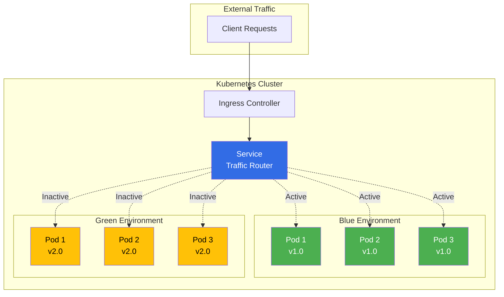
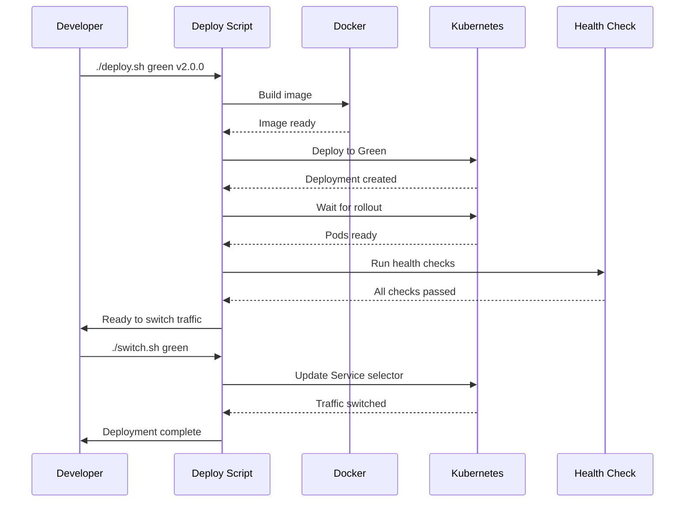

# Blue-Green Deployment with Kubernetes & Docker

A production-ready **Blue-Green Deployment** system using **Kubernetes** for orchestration and **Docker** for containerization. This implementation enables **zero-downtime releases**, **instant rollback capability**, and **controlled traffic switching** for containerized web applications.


## 📋 Table of Contents

- [Architecture](#architecture)
- [Features](#features)
- [Prerequisites](#prerequisites)
- [Quick Start](#quick-start)
- [Deployment Workflow](#deployment-workflow)
- [Scripts](#scripts)
- [CI/CD Pipeline](#cicd-pipeline)
- [Monitoring](#monitoring)
- [Troubleshooting](#troubleshooting)

## 🏗️ Architecture



### How It Works

1. **Blue and Green environments** run simultaneously
2. **Kubernetes Service** routes traffic using label selectors (`version: blue` or `version: green`)
3. **Traffic switching** is instant - just update the Service selector
4. **Rollback** is equally instant - switch selector back to previous version
5. **Zero downtime** - both environments are always ready

## ✨ Features

- ✅ **Zero-Downtime Deployments** - No service interruption during updates
- ✅ **Instant Rollback** - Switch back to previous version in seconds
- ✅ **Health Checks** - Kubernetes liveness, readiness, and startup probes
- ✅ **Automated CI/CD** - GitHub Actions workflow for automated deployments
- ✅ **Prometheus Metrics** - Built-in metrics endpoint for monitoring
- ✅ **Production-Ready** - Multi-stage Docker builds, non-root containers
- ✅ **Comprehensive Scripts** - Deploy, switch, rollback, and health-check automation

## 📦 Prerequisites

### Required Tools

- **Docker** (v20.10+)
- **Kubernetes** cluster (Minikube, Kind, GKE, EKS, or AKS)
- **kubectl** (v1.25+)
- **bash** (for automation scripts)

### Optional Tools

- **Docker Hub** account (for image registry)
- **GitHub** account (for CI/CD pipeline)

### Local Kubernetes Setup

**Option 1: Minikube**
```bash
# Install Minikube
curl -LO https://storage.googleapis.com/minikube/releases/latest/minikube-linux-amd64
sudo install minikube-linux-amd64 /usr/local/bin/minikube

# Start cluster
minikube start --driver=docker
```

**Option 2: Kind (Kubernetes in Docker)**
```bash
# Install Kind
curl -Lo ./kind https://kind.sigs.k8s.io/dl/latest/kind-linux-amd64
chmod +x ./kind
sudo mv ./kind /usr/local/bin/kind

# Create cluster
kind create cluster --name blue-green
```

**Option 3: Docker Desktop**
- Enable Kubernetes in Docker Desktop settings

## 🚀 Quick Start

### 1. Clone and Setup

```bash
# Navigate to project directory
cd blue-green-k8s

# Make scripts executable
chmod +x scripts/*.sh
```

### 2. Build and Deploy Blue Version

```bash
# Build Docker image and deploy Blue version
./scripts/deploy.sh blue v1.0.0
```

### 3. Create Service (First Time Only)

```bash
# Apply service configuration
kubectl apply -f k8s/service.yaml

# Apply ingress (optional)
kubectl apply -f k8s/ingress.yaml
```

### 4. Verify Blue Deployment

```bash
# Check pods
kubectl get pods -n blue-green -l version=blue

# Test health
./scripts/health-check.sh blue

# Get service URL
kubectl get service webapp-service -n blue-green
```

### 5. Deploy Green Version

```bash
# Build and deploy Green version
./scripts/deploy.sh green v2.0.0
```

### 6. Switch Traffic to Green

```bash
# Switch traffic from Blue to Green
./scripts/switch.sh green

# Verify version
kubectl get service webapp-service -n blue-green -o yaml | grep version
```

### 7. Rollback (if needed)

```bash
# Instant rollback to previous version
./scripts/rollback.sh
```

## 🔄 Deployment Workflow



## 📜 Scripts

### deploy.sh

Deploy a new version to Blue or Green environment.

```bash
./scripts/deploy.sh <version> <image-tag>

# Examples
./scripts/deploy.sh blue v1.0.0
./scripts/deploy.sh green v2.0.0
```

**What it does:**
- Builds Docker image
- Pushes to registry (optional)
- Deploys to Kubernetes
- Waits for pods to be ready
- Runs health checks

### switch.sh

Switch traffic between Blue and Green versions.

```bash
./scripts/switch.sh <target-version>

# Examples
./scripts/switch.sh green  # Switch to Green
./scripts/switch.sh blue   # Switch to Blue
```

**What it does:**
- Validates target version health
- Updates Service selector
- Verifies traffic routing
- Logs switch event

### rollback.sh

Instantly rollback to previous version.

```bash
./scripts/rollback.sh
```

**What it does:**
- Determines current and previous versions
- Validates previous version health
- Switches traffic back
- Logs rollback event

### health-check.sh

Comprehensive health validation.

```bash
./scripts/health-check.sh <version>

# Examples
./scripts/health-check.sh blue
./scripts/health-check.sh green
```

**What it does:**
- Checks pod readiness
- Tests `/health` endpoint
- Tests `/version` endpoint
- Tests `/ready` endpoint

## 🔧 CI/CD Pipeline

### GitHub Actions Setup

1. **Add Secrets** to your GitHub repository:
   - `DOCKER_USERNAME` - Docker Hub username
   - `DOCKER_PASSWORD` - Docker Hub password/token
   - `KUBE_CONFIG` - Base64-encoded kubeconfig

2. **Get kubeconfig** (base64 encoded):
```bash
cat ~/.kube/config | base64 -w 0
```

3. **Trigger Workflow**:
   - **Automatic**: Push to `main` branch
   - **Manual**: GitHub Actions → Run workflow

### Workflow Features

- ✅ Automated Docker build and push
- ✅ Auto-detection of inactive environment
- ✅ Health checks before traffic switch
- ✅ Automatic rollback on failure
- ✅ Deployment notifications

## 📊 Monitoring

### Application Endpoints

| Endpoint | Purpose |
|----------|---------|
| `/` | Main application |
| `/version` | Version information |
| `/health` | Health check (liveness) |
| `/ready` | Readiness check |
| `/metrics` | Prometheus metrics |
| `/api/data` | Sample API endpoint |

### Check Deployment Status

```bash
# Get all resources
kubectl get all -n blue-green

# Check pods
kubectl get pods -n blue-green -l app=webapp

# Check service
kubectl get service webapp-service -n blue-green

# View logs
kubectl logs -n blue-green -l version=blue --tail=50
kubectl logs -n blue-green -l version=green --tail=50

# Describe pod
kubectl describe pod <pod-name> -n blue-green
```

### Prometheus Metrics

Access metrics endpoint:
```bash
# Port forward to a pod
kubectl port-forward -n blue-green <pod-name> 5000:5000

# Access metrics
curl http://localhost:5000/metrics
```

## 🐛 Troubleshooting

### Pods Not Starting

```bash
# Check pod status
kubectl get pods -n blue-green

# View pod events
kubectl describe pod <pod-name> -n blue-green

# Check logs
kubectl logs <pod-name> -n blue-green
```

### Health Checks Failing

```bash
# Test health endpoint directly
kubectl exec -n blue-green <pod-name> -- curl http://localhost:5000/health

# Check probe configuration
kubectl get pod <pod-name> -n blue-green -o yaml | grep -A 10 livenessProbe
```

### Traffic Not Switching

```bash
# Verify service selector
kubectl get service webapp-service -n blue-green -o yaml | grep -A 5 selector

# Check pod labels
kubectl get pods -n blue-green --show-labels
```

### Image Pull Errors

```bash
# For local testing, use Minikube's Docker daemon
eval $(minikube docker-env)

# Rebuild image
docker build -t your-registry/blue-green-app:blue .

# Or use imagePullPolicy: Never for local images
```

## 📁 Project Structure

```
blue-green-k8s/
├── app/
│   ├── app.py              # Flask application
│   └── requirements.txt    # Python dependencies
├── k8s/
│   ├── namespace.yaml      # Kubernetes namespace
│   ├── deployment-blue.yaml   # Blue deployment
│   ├── deployment-green.yaml  # Green deployment
│   ├── service.yaml        # Service (traffic router)
│   ├── ingress.yaml        # Ingress controller
│   └── configmap.yaml      # Configuration
├── scripts/
│   ├── deploy.sh           # Deployment script
│   ├── switch.sh           # Traffic switching script
│   ├── rollback.sh         # Rollback script
│   └── health-check.sh     # Health validation script
├── .github/
│   └── workflows/
│       └── deploy.yml      # CI/CD pipeline
├── docs/
│   ├── DEPLOYMENT.md       # Detailed deployment guide
│   └── TROUBLESHOOTING.md  # Troubleshooting guide
├── Dockerfile              # Multi-stage Docker build
├── .dockerignore           # Docker ignore file
└── README.md               # This file
```

## 🎯 Next Steps

1. **Customize Application**: Modify `app/app.py` for your use case
2. **Configure Registry**: Update image registry in scripts and manifests
3. **Set Up CI/CD**: Configure GitHub Actions secrets
4. **Add Monitoring**: Integrate Prometheus and Grafana
5. **Production Deployment**: Deploy to cloud Kubernetes (GKE/EKS/AKS)

## 📚 Additional Resources

- [Kubernetes Documentation](https://kubernetes.io/docs/)
- [Docker Documentation](https://docs.docker.com/)
- [Blue-Green Deployment Pattern](https://martinfowler.com/bliki/BlueGreenDeployment.html)
- [Kubernetes Best Practices](https://kubernetes.io/docs/concepts/configuration/overview/)

## 📄 License

This project is open source and available for educational and commercial use.

---

**Built with ❤️ for Zero-Downtime Deployments**
